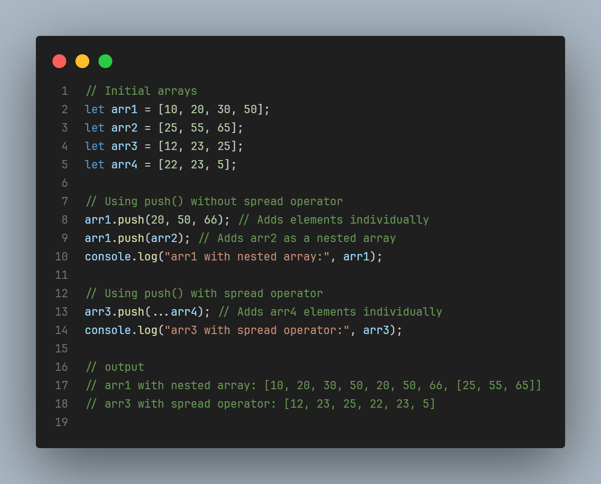

# JavaScript Array Notes

## What is an Array?

A JavaScript array is an ordered, zero-indexed collection of elements used to store multiple values in a single variable.

- Arrays are dynamic, mutable, and can hold mixed data types (e.g., numbers, strings, objects).
- Arrays are objects in JavaScript, inheriting from `Array.prototype`, with special behavior for numeric indices and the `length` property.
- Declared using square brackets `[]` or the `Array` constructor.

---

## Creation Examples

```javascript
// Literal notation (preferred)
let arr = [1, "text", { key: "value" }];

// Array constructor
let arr2 = new Array(3); // [undefined, undefined, undefined]
let arr3 = new Array(1, 2, 3); // [1, 2, 3]
```

---


## Characteristics of Arrays

- **Ordered Collection**: Elements are stored in a specific order, accessed via zero-based indices.
- **Dynamic Size**: Arrays can grow or shrink automatically as elements are added or removed.
- **Heterogeneous**: Can store different data types in the same array (e.g., `[1, "hello", {}]`).
- **Mutable**: Elements can be changed, added, or removed after creation.
- **Object Type**: Arrays are objects, with numeric keys and additional methods from `Array.prototype`.
- **Auto-updating Length**: The `length` property reflects the number of elements and updates dynamically.
- **Sparse Arrays**: Can have "empty" slots (e.g., `new Array(3)` creates an array with undefined elements).
- **Rich Methods**: Supports a variety of built-in methods for manipulation, iteration, and transformation.
- **Shallow Copy Behavior**: Methods like `slice` or spread (`...`) create shallow copies, referencing nested objects.
- **Iterable**: Compatible with iteration protocols like `for...of`, `forEach`, and spread operator.

---

## Array Methods

### Adding/Removing Elements

```javascript
push(...items); // Adds elements to the end, returns new length.
pop(); // Removes and returns the last element.
unshift(...items); // Adds elements to the start, returns new length.
shift(); // Removes and returns the first element.
```



```javascript
let fruits = ["apple", "banana"];
fruits.push("orange"); // ["apple", "banana", "orange"]
fruits.pop(); // Returns "orange", array: ["apple", "banana"]
fruits.unshift("kiwi"); // ["kiwi", "apple", "banana"]
fruits.shift(); // Returns "kiwi", array: ["apple", "banana"]
```

---

### Iteration Methods

```javascript
forEach(callback); // Executes a callback for each element.
map(callback); // Creates a new array with results of callback.
filter(callback); // Creates a new array with elements that pass the test.
reduce(callback, initialValue); // Reduces to a single value.
```

```javascript
let nums = [1, 2, 3];
nums.forEach((n) => console.log(n)); // Logs 1, 2, 3
let doubled = nums.map((n) => n * 2); // [2, 4, 6]
let evens = nums.filter((n) => n % 2 === 0); // [2]
let sum = nums.reduce((acc, n) => acc + n, 0); // 6
```

---

### Searching and Sorting

```javascript
find(callback); // Returns first match.
indexOf(item); // Returns index or -1.
includes(item); // Checks existence.
sort([compareFunction]); // Sorts in place.
reverse(); // Reverses in place.
```

```javascript
let arr = [10, 20, 30];
arr.find((n) => n > 15); // 20
arr.indexOf(20); // 1
arr.includes(30); // true
arr.sort((a, b) => a - b); // [10, 20, 30]
arr.reverse(); // [30, 20, 10]
```

---

### Slicing and Splicing

```javascript
slice(start, end); // Shallow copy portion.
splice(start, deleteCount, ...items); // Modifies array.
```

```javascript
let arr = [1, 2, 3, 4];
arr.slice(1, 3); // [2, 3]
arr.splice(1, 2, 5, 6); // Returns [2, 3], arr: [1, 5, 6, 4]
```

---

### Joining and Concatenation

```javascript
join(separator); // Joins into a string.
concat(...arrays); // Merges arrays.
```

```javascript
let arr = ["a", "b", "c"];
arr.join("-"); // "a-b-c"
let newArr = arr.concat([1, 2]); // ["a", "b", "c", 1, 2]
```

---

### Other Useful Methods

```javascript
every(callback); // True if all match.
some(callback); // True if one matches.
flat(depth); // Flattens nested arrays.
fill(value, start, end); // Fills with value.
```

```javascript
let nums = [1, 2, 3];
nums.every((n) => n > 0); // true
nums.some((n) => n > 2); // true
let nested = [1, [2, 3]];
nested.flat(); // [1, 2, 3]
nums.fill(0, 1, 3); // [1, 0, 0]
```

---

## Additional Features

### Spread Operator

Expands array elements for copying or merging.

```javascript
let arr1 = [1, 2];
let arr2 = [...arr1, 3, 4]; // [1, 2, 3, 4]
let copy = [...arr1]; // Shallow copy
```

### Destructuring

Extracts elements into variables.

```javascript
let [first, second] = [1, 2, 3]; // first = 1, second = 2
```

### Multi-dimensional Arrays

Arrays can contain other arrays.

```javascript
let matrix = [
  [1, 2],
  [3, 4],
];
matrix[0][1]; // 2
```

---

## Best Practices

- Use literal notation `[]` instead of `new Array()` for simplicity.
- Prefer `const` for array declarations to prevent reassignment (methods still work).
- Use spread operator (`...`) for safe copying to avoid unintended mutations.
- Choose the right method for the task (e.g., `map` for transformation, `filter` for selection).
- Handle edge cases (e.g., empty arrays, invalid indices) to avoid errors.

---

## Common Pitfalls

- Mutating methods (`splice`, `sort`, etc.) modify the original array.
- Sparse arrays may cause unexpected behavior in loops or methods.
- `forEach` cannot be broken early (use `for...of` or `some` instead).
- Shallow copying means nested objects are referenced, not duplicated.
